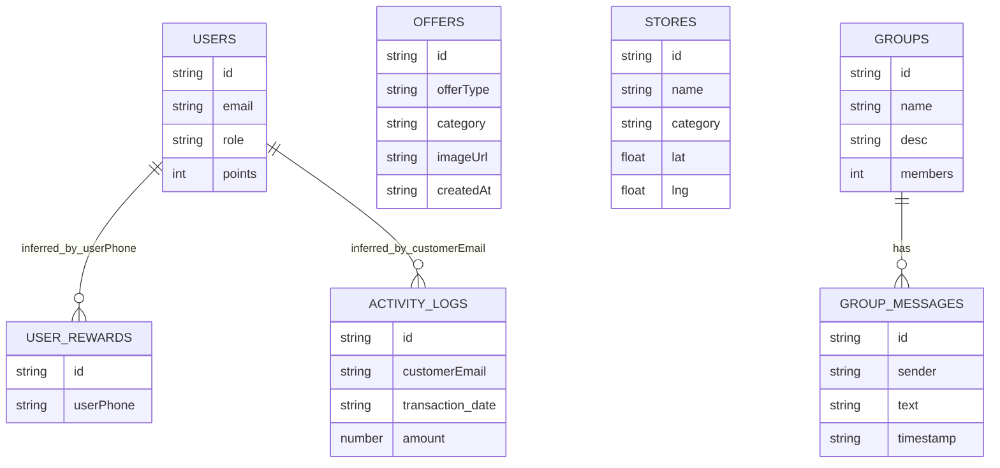

# PHASE 0 — PROJECT DISCOVERY REPORT

## Scope audited
- Source, configs, platform folders, tests, localization, and generated artifacts under the repository.
- Key files inspected include `README.md`, `pubspec.yaml`, `lib/main.dart`, `lib/services/supabase_service.dart`, `lib/screens/home_screen.dart`, `lib/screens/settings_screen.dart`, `lib/screens/signup_screen.dart`, `lib/screens/login_screen.dart`, `android/app/src/main/AndroidManifest.xml`, `ios/Runner/Info.plist`, `test/widget_test.dart`.

## Current architecture
- Flutter multi-platform app (mobile + desktop + web) with code in `lib/`.
- Active backend usage is Firebase:
  - Firebase init in `lib/main.dart`
  - Auth in `lib/screens/login_screen.dart`, `lib/screens/signup_screen.dart`
  - Firestore usage across offers/users/groups/stores/rewards-like flows
- Secondary Supabase integration exists but disabled:
  - Disabled flag in `lib/services/supabase_service.dart`
  - Hardcoded Supabase URL and anon key in same file
- No server-side code in repository:
  - API routes: **NOT FOUND**
  - Next.js project: **NOT FOUND**
  - package.json: **NOT FOUND**

## Folder structure (functional high-level)
- App source: `lib/`
- Assets + i18n: `assets/`
- Platform runners: `android/`, `ios/`, `web/`, `windows/`, `macos/`, `linux/`
- Tests: `test/`
- Generated/build artifacts present: `build/`, `.dart_tool/`

## Dependencies
From `pubspec.yaml`:
- Core: flutter, flutter_localizations, easy_localization, shared_preferences
- Firebase: firebase_core, firebase_auth, cloud_firestore, firebase_storage
- Supabase: supabase_flutter
- Maps/location UI: flutter_map, google_maps_flutter, latlong2
- Media/input: image_picker, permission_handler
- Network: dio, http
- UI/charts: fl_chart, carousel_slider, badges, flutter_speed_dial, share_plus, url_launcher

## Completed modules (evidence-backed)
- App bootstrap + onboarding gate + localization in `lib/main.dart`
- Customer signup/login via Firebase in `lib/screens/signup_screen.dart`, `lib/screens/login_screen.dart`
- Offer creation UI + Firestore write in `lib/screens/add_coupon_screen.dart`
- Offer feeds/detail in `lib/screens/offers_screen.dart`, `lib/screens/offer_detail_screen.dart`
- Community group list and group chat stream-read in `lib/screens/community_screen.dart`
- Store map rendering from Firestore in `lib/screens/full_map_screen.dart`, `lib/widgets/map_bar.dart`

## Partially completed modules
- Rewards/points mostly static/demo in `lib/screens/my_rewards_screen.dart`
- Points widget exists but not integrated as full flow in `lib/screens/points_screen.dart`
- Reports UI exists, backend submit placeholder in `lib/screens/report_screen.dart`
- Invoice scan uses camera but OCR is mocked in `lib/screens/scan_invoice_screen.dart`
- Profile/user flows exist but inconsistent field naming across files

## Missing modules
- Web dashboard: **NOT FOUND**
- Admin dashboard (separate module/app): **NOT FOUND**
- Merchant portal module: **NOT FOUND**
- Agent module: **NOT FOUND**
- API backend routes/services: **NOT FOUND**
- SQL migrations: **NOT FOUND**
- Supabase schema files: **NOT FOUND**
- Environment files (.env*): **NOT FOUND**
- Firebase firestore/storage rules files: **NOT FOUND**

## Broken modules / runtime risks
- Tests failing:
  - `test/widget_test.dart` fails with EasyLocalization context/runtime mismatch.
- Likely broken named routes in `lib/screens/settings_screen.dart` (`/`, `/categories`, `/favorites`) without route map in `lib/main.dart`.
- Data model mismatch between offer writer and readers:
  - Writer uses `imageUrl`, `discountValue`
  - Readers often expect `image`, `storeName`, `percent`
- Drawer references missing asset `assets/images/profile.jpg` (file not found).
- Multiple placeholder/whitespace-only screens (about/help/privacy/terms/notifications/etc.).

## Technical debt
- Mixed backend strategy (Firebase active + Supabase disabled but referenced).
- Hardcoded sample/mock content in core flows.
- Many unused imports/dead code and style issues (72 analyzer issues found).
- Default README and no architecture/planning markdown docs.
- Default sample widget test not aligned with actual app architecture.

## Security issues
- Secrets/config keys committed in code:
  - Firebase keys in `lib/firebase_options.dart`
  - Supabase anon key in `lib/services/supabase_service.dart`
  - Imgur client ID in `lib/services/imgur_service.dart`
  - Firebase config in `android/app/google-services.json`
- Placeholder Google Maps key still in:
  - `android/app/src/main/AndroidManifest.xml`
  - `web/index.html`
- No repository evidence of rules/policies files for Firestore/Storage.
- No clear role-based authorization enforcement for merchant/agent/admin paths.

## Database status
- Schema files: **NOT FOUND**
- Migration history: **NOT FOUND**
- Supabase RLS/policies scripts: **NOT FOUND**
- Firestore collections referenced by code:
  - `users`, `offers`, `groups`, `messages`, `stores`, `user_rewards`, `activity_logs`
- Index/config artifacts for Firestore queries: **NOT FOUND**
- Foreign keys/constraints: **CANNOT VERIFY**

## Inferred ERD (code-derived)

## Estimated completion percentage
- Feature model used: Customer (15) + Merchant (11) + Agent (3) + Admin (9) = 38 features.
- Scoring: full = 1, partial = 0.5, missing = 0.
- Observed score approximately 7.5 / 38.
- Estimated completion: **~20%**.

## Discovery caveat
- `تطبيق كوبونا.docx` exists, but extraction in current session returned corrupted/unrelated output.
- Content-based requirement recovery from that file: **CANNOT VERIFY**.

---

# PHASE 1 — REQUIREMENTS RECOVERY REPORT

Recovered from repository evidence:
- The implemented product direction is a customer-focused coupon/loyalty app prototype with offers, points/rewards concepts, map, invoice scan, and community.
- Primary implemented actor is Customer.
- Merchant/Agent/Admin complete role modules are not present as dedicated systems.

Documentation evidence:
- `README.md` is default Flutter template.
- Architecture docs: **NOT FOUND**.
- Planning docs (text/markdown): **NOT FOUND**.
- TODO files: **NOT FOUND**.

Conclusion:
- Recovered vision from code is a partially implemented customer app, not yet a complete multi-actor loyalty platform.

---

# PHASE 2 — GAP ANALYSIS REPORT

| Feature | Current State | Missing | Priority | Estimated effort | Dependencies |
|---|---|---|---|---|---|
| Customer Registration | Implemented via Firebase Auth | Profile completeness enforcement | High | 2-3 days | Firebase Auth, Firestore users |
| Customer Login | Implemented email/password | Phone login real flow, password recovery UX | High | 2-4 days | Firebase Auth |
| Wallet | NOT FOUND | Full wallet model, balance, ledger UI/API | High | 8-12 days | Data model, secure backend logic |
| QR Code | Partial mock in rewards dialog | Real QR generation/verification flow | High | 4-6 days | QR library, redemption backend |
| Points | Partial (static + optional history) | Unified points engine, accrual rules, expiry | High | 8-14 days | Transaction model |
| Cashback | NOT FOUND | Cashback rules and posting | Medium | 8-12 days | Wallet + ledger |
| Coupons | Partial create/list/detail | Ownership + redemption lifecycle | High | 8-12 days | Canonical coupon schema |
| Rewards | Partial mostly static | Dynamic catalog + redemption pipeline | High | 8-12 days | Points engine |
| Offers | Partial Firestore feeds | Data consistency + moderation | High | 6-10 days | Canonical offer schema |
| Merchant Map | Partial stores map | Branch management and governance | Medium | 4-8 days | Stores schema |
| Invoice Scan | Partial mocked OCR | Real OCR + fraud checks + posting | High | 10-15 days | OCR service |
| Notifications | Placeholder screen | Push/local notifications | Medium | 6-10 days | FCM and prefs |
| History | Partial activity log | Unified transaction timeline | Medium | 4-8 days | Event schema |
| Profile | Partial read/edit | Full profile domain and validations | Medium | 4-7 days | Users schema |
| Merchant Dashboard | NOT FOUND | Merchant dashboard module | High | 10-15 days | Merchant auth |
| Merchant Branches | NOT FOUND | Branch CRUD | High | 6-10 days | Merchant domain |
| Merchant Employees | NOT FOUND | Team roles/invites | High | 8-12 days | AuthZ |
| Merchant Offers | NOT FOUND | Merchant-scoped offer management | High | 6-10 days | Merchant identity link |
| Merchant Coupons | NOT FOUND | Issuance/tracking | High | 6-10 days | Coupon engine |
| Merchant Campaigns | NOT FOUND | Campaign lifecycle + approval | High | 10-14 days | Admin workflow |
| Merchant Customers | NOT FOUND | CRM views/segments | Medium | 6-10 days | Privacy model |
| Merchant Analytics | NOT FOUND | KPI/reporting | Medium | 8-12 days | Events pipeline |
| Merchant Wallet | NOT FOUND | Settlement wallet | High | 10-14 days | Ledger |
| Merchant Subscription | NOT FOUND | Plans/billing/renewals | High | 10-14 days | Billing integration |
| Merchant QR validation | NOT FOUND | POS validation flow | High | 6-10 days | QR backend |
| Agent onboarding | NOT FOUND | Agent workflow | High | 8-12 days | Merchant pipeline |
| Agent commission tracking | NOT FOUND | Commission ledger | High | 8-12 days | Finance model |
| Agent merchant activation | NOT FOUND | Activation workflow | Medium | 4-8 days | Merchant status model |
| Admin users | Partial listing | Full CRUD + role admin + audit | High | 6-10 days | RBAC |
| Admin merchants | NOT FOUND | Merchant administration | High | 6-10 days | Merchant domain |
| Admin categories | NOT FOUND | Taxonomy management | Medium | 3-6 days | Category schema |
| Admin cities | NOT FOUND | Geo/city management | Medium | 3-6 days | Location schema |
| Campaign approval | NOT FOUND | Queue + decision logs | High | 6-10 days | Campaign module |
| Subscription management | NOT FOUND | Plan controls/invoicing | High | 8-12 days | Billing backend |
| Reports | Partial local UI only | Operational/business reports | Medium | 6-10 days | Analytics pipeline |
| Fraud detection | NOT FOUND | Rules/anomaly layer | High | 10-16 days | Behavioral + invoice data |
| System configuration | Partial app settings UI | Platform control plane | Medium | 5-8 days | Admin backend |

---

# PHASE 3 — MASTER EXECUTION PLAN REPORT

Dependency-ordered roadmap:

1. **Baseline stabilization + architecture decision**
- Decide backend authority (Firebase-first or Supabase-first).
- Remove architectural drift and define module boundaries.

2. **Security/config hardening**
- Remove hardcoded secrets from source.
- Add security rules/policies artifacts.
- Define RBAC model.

3. **Data model and migration strategy**
- Define canonical entities for customer/merchant/agent/admin workflows.
- Add indexed query strategy and schema versioning artifacts.

4. **Core loyalty engines**
- Ledger (points/cashback/wallet), coupon lifecycle, reward redemption, QR validation.

5. **Customer path completion**
- Complete notifications, invoice OCR, wallet/history, route fixes, and placeholder replacements.

6. **Merchant module delivery**
- Dashboard, branches, employees, offers, campaigns, analytics, wallet/subscription, QR validation.

7. **Agent module delivery**
- Merchant onboarding, commission tracking, merchant activation.

8. **Admin control plane delivery**
- Users/merchants/categories/cities, campaign approvals, subscriptions, reports, fraud, config.

9. **Quality gates + CI**
- Clean analyzer baseline, real tests, build matrix, docs updates.

10. **Release readiness**
- Performance, security audit, observability, rollback/UAT checklists.

Milestones:
- Milestone A: Steps 1-3
- Milestone B: Steps 4-5
- Milestone C: Steps 6-7
- Milestone D: Steps 8-10

---

Implementation has **not** started in this report file (as requested).